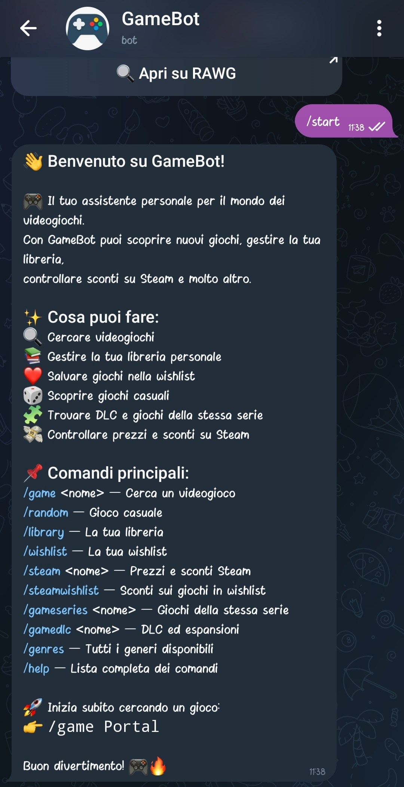
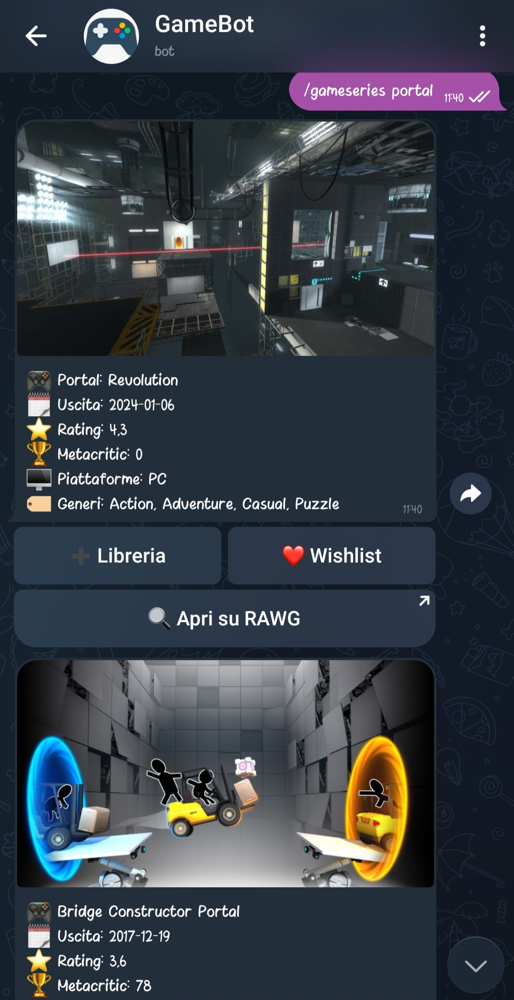
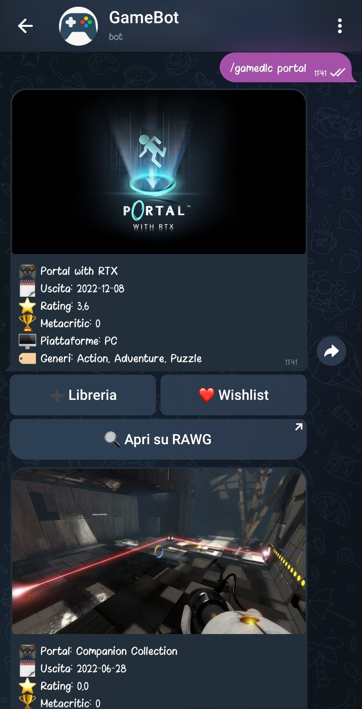
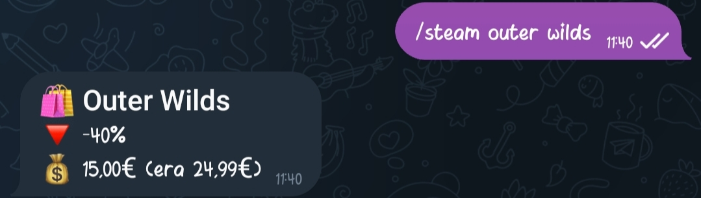

# 🎮 GameBot – Telegram Videogame Assistant

GameBot è un **bot Telegram** che consente di cercare videogiochi, gestire una **libreria personale** e una **wishlist**, scoprire giochi casuali, visualizzare **DLC e serie**, e controllare **prezzi e sconti su Steam**.

Il bot utilizza **API pubbliche** (RAWG e Steam Store API) e un **database locale** per salvare i dati degli utenti.

---

## ✨ Funzionalità principali

- 🔍 Ricerca videogiochi per nome  
- 🎲 Giochi casuali (anche filtrati per genere)  
- 📚 Libreria personale  
- ❤️ Wishlist personale  
- 🧩 Giochi appartenenti alla stessa serie  
- 🧱 DLC ed espansioni  
- 💸 Prezzi e sconti Steam  
- 🛒 Verifica sconti sui giochi in wishlist  
- 📊 Statistiche personali  

---

## 🔌 API Utilizzate

#### 🎮 RAWG Video Games Database API

Utilizzata per:
- Ricerca videogiochi
- Giochi casuali
- Generi
- Serie di giochi
- DLC

📚 Documentazione ufficiale:  
https://rawg.io/apidocs  

🔑 **API Key richiesta**

---

#### 💰 Steam Store API (non ufficiale)

Utilizzata per:
- Prezzi dei giochi
- Sconti attivi
- Verifica sconti della wishlist

📚 Documentazione:  
https://partner.steamgames.com/doc/store/storefront  
https://stackoverflow.com/questions/70147813/steam-api-endpoint-appdetails-params
https://github.com/autarc/steam-store

❗ **Non richiede API Key**

---

## 🗄️ Database

Il bot utilizza un **database locale** per memorizzare gli utenti Telegram e i videogiochi salvati in **libreria** e **wishlist**.

### 📦 Tabelle

#### Users
| Campo | Tipo |
|------|------|
| id | INT |
| telegram_id | INT |

---

#### Games
| Campo | Tipo |
|------|------|
| id | INT |
| name |VARCHAR(255) |
| released |VARCHAR(255) |
| rating | FLOAT |
| metacritic | INT |
| image_url |VARCHAR(255) |

---

#### library
| Campo | Tipo |
|------|------|
| user_id | INT |
| game_id | INT |

---

#### Wishlist
| Campo | Tipo |
|------|------|
| user_id | INT |
| game_id | INT |

---

### 🔗 Relazioni

- **users 1 → N library**
- **users 1 → N wishlist**
- **games 1 → N library**
- **games 1 → N wishlist**

Ogni utente Telegram può salvare più giochi nella propria libreria e wishlist.

---

## 🕹️ Comandi disponibili

### 📌 Comandi base
| Comando | Descrizione |
|-------|------------|
| `/start` | Messaggio di benvenuto |
| `/help` | Lista completa dei comandi |

---

### 🔍 Ricerca e scoperta giochi
| Comando | Descrizione |
|-------|------------|
| `/game <nome>` | Cerca un videogioco |
| `/random` | Gioco casuale |
| `/random <n>` | N giochi casuali |
| `/random genre <genere>` | Gioco casuale per genere |
| `/random genre <genere> <n>` | N giochi casuali per genere |
| `/genres` | Elenco generi disponibili |

---

### 📚 Libreria e Wishlist
| Comando | Descrizione |
|-------|------------|
| `/library` | Mostra la tua libreria |
| `/wishlist` | Mostra la tua wishlist |

➡️ I giochi possono essere **aggiunti o rimossi** tramite pulsanti inline sotto ogni risultato.

---

### 🧩 Contenuti extra
| Comando | Descrizione |
|-------|------------|
| `/gameseries <nome>` | Giochi della stessa serie |
| `/gamedlc <nome>` | DLC ed espansioni |

---

### 💸 Steam
| Comando | Descrizione |
|-------|------------|
| `/steam <nome>` | Prezzo e sconto Steam |
| `/steamwishlist` | Controlla sconti per la wishlist |

---

### 📊 Statistiche
| Comando | Descrizione |
|-------|------------|
| `/stats` | Statistiche personali |

---

## 💬 Esempi di conversazione








---

## ⚙️ Setup del progetto

### 1️) Ottenere la API Key RAWG

1. Registrati su https://rawg.io/apidocs  
2. Ottieni la tua **API Key**
3. Copia il file di esempio `config.properties.example` e rinominalo `config.properties`
4. Inserisci l'**API Key** nel file `config.properties`


```properties
APIKEY_RAWG = inserisci_qui_la_tua_chiave
```


### 2) Crea un bot tramite BotFather

1. Crea il nuovo bot seguendo la documentazione di BotFather
2. Inserisci il bot token nel file `config.properties`

```properties
BOT_TOKEN = inserisci_qui_il_token_bot
```

---

## ⚙️ Dipendenze maven

```
<dependencies>
        <dependency>
            <groupId>com.google.code.gson</groupId>
            <artifactId>gson</artifactId>
            <version>2.13.1</version>
        </dependency>

        <dependency>
            <groupId>org.telegram</groupId>
            <artifactId>telegrambots-longpolling</artifactId>
            <version>9.2.0</version>
        </dependency>

        <dependency>
            <groupId>org.telegram</groupId>
            <artifactId>telegrambots-client</artifactId>
            <version>9.2.0</version>
        </dependency>

        <dependency>
            <groupId>org.apache.commons</groupId>
            <artifactId>commons-configuration2</artifactId>
            <version>2.12.0</version>
        </dependency>

        <dependency>
            <groupId>commons-beanutils</groupId>
            <artifactId>commons-beanutils</artifactId>
            <version>1.9.4</version>
        </dependency>

        <dependency>
            <groupId>org.testng</groupId>
            <artifactId>testng</artifactId>
            <version>RELEASE</version>
            <scope>compile</scope>
        </dependency>

        <dependency>
            <groupId>org.xerial</groupId>
            <artifactId>sqlite-jdbc</artifactId>
            <version>3.45.1.0</version>
        </dependency>
    </dependencies>
```

---

## ⚙️ Esempi query più importanti

### Query API

- Ottenere i dati di un gioco a partire dal nome
```https://api.rawg.io/api/games?key=b4a500e320d749ba9793d7c490793c2e&search=<nome>&page_size=1```

- Ottenere i dati di un gioco a partire dal suo ID nell'API di RAWG
```https://api.rawg.io/api/games/<Id>?key=b4a500e320d749ba9793d7c490793c2e&page_size=1```

- Ottenere giochi appartenenti ad un genere
```https://api.rawg.io/api/games?key=b4a500e320d749ba9793d7c490793c2e&genres=<genere>&page_size=5```

---

### Query DB locale

- Ottenere l'ID dell'utente nel DB a partire dall'ID telegram
```SELECT id FROM Users WHERE telegram_id = ?```

- Inserire nel DB un gioco
```INSERT OR IGNORE INTO Games(id, name, released, rating, metacritic, image_url) VALUES (?, ?, ?, ?, ?, ?)```

- Inserire un gioco nella libreria di un utente
```INSERT OR IGNORE INTO Library (user_id, game_id) VALUES (?, ?)```

- Ottenere tutti i giochi presenti nella libreria di un utente
```SELECT g.* FROM Library l INNER JOIN Games g ON l.game_id = g.id WHERE l.user_id = ? ORDER BY g.name```
